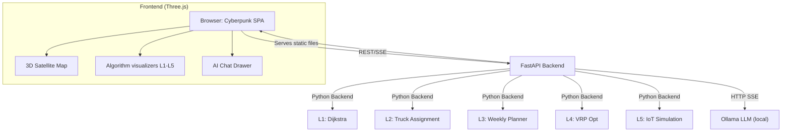

<h1 align="center">
  <br>
  
  <br>
  CyberCollect 🛰️
</h1>

<h4 align="center">A Production-Grade Cyberpunk 3D Route Optimization & Waste Management Platform</h4>

<p align="center">
  <a href="#key-features">Features</a> •
  <a href="#architecture">Architecture</a> •
  <a href="#the-5-levels-of-optimization">The 5 Levels</a> •
  <a href="#quick-start">Quick Start</a> •
  <a href="#deployment">Deployment</a>
</p>

---

## 🌌 Overview

**CyberCollect** transforms a multi-tiered waste collection optimization project into a stunning, interactive, cyberpunk-themed Web application. 

Built with **FastAPI** on the backend and native **Three.js + HTML/JS/CSS** on the frontend, the application visualizes complex algorithmic data—ranging from Dijkstra graphing to VRP Tabu searches—on a glowing 3D WebGL satellite map. It also features an integrated **Local LLM AI Assistant** to analyze data and operations in real-time.


## 🚀 Key Features

*   **Cyberpunk 3D Visualization:** Natively rendered Three.js scene mimicking a high-tech tracking satellite. Includes neon grids, bloom effects, animated routes, and pulsing alert nodes.
*   **Multi-Level Algorithmic APIs:** 5 distinct Python optimization engines exposed via RESTful APIs.
*   **Live Dashboard & Visualizers:** Real-time generation of Gantt charts, radial utilization bars, and distance convergence curves synced to 3D map animations.
*   **Local AI Assistance (Ollama):** Slide-in chat panel with Server-Sent Events (SSE) streaming. The AI is automatically injected with the contextual state of whatever algorithm is currently running on-screen.
*   **Zero-Cost Native Deployment:** Configured via Docker & Render Blueprints to run completely free ($0/mo) in the cloud.

---

## 🧠 The 5 Levels of Optimization

The backend handles five distinct, progressively complex operational tiers of municipal waste logic:

1.  **Level 1 (Shortest Path):** Constructs the road mesh using Dijkstra's algorithm to analyze raw travel distance and constraints between collection nodes.
2.  **Level 2 (Greedy Assignments & Load Balancing):** Triages incoming zone demands and optimally assigns them to truck pools using greedy capacities and variance minimization.
3.  **Level 3 (Tri-partite Schedule Planning):** Solves time-window constraints (traffic congestion, legal driving hours, night restrictions) and generates full weekly truck collection schedules.
4.  **Level 4 (Vehicle Routing Problem - VRP):** Uses **2-Opt & Tabu Search heuristics** to generate exact stop-by-stop sequencing and turn-by-turn routing for each truck in the fleet.
5.  **Level 5 (Real-time IoT Simulation):** A live streaming engine ticking by the minute. Simulated IoT bin sensors trigger `ALERTE_REMPLISSAGE` events, forcing live tactical dashboard updates.

---

## 🏗 Architecture



---

## 📦 Quick Start (Local Run)

You can run CyberCollect directly on your local machine using Python or Docker.

### Option A: Python / Uvicorn (Recommended)
1. **Clone the repo:**
   ```bash
   git clone https://github.com/desagencydes-rgb/CYBERCOLLECT.git
   cd CYBERCOLLECT
   ```
2. **Install requirements:**
   ```bash
   pip install fastapi uvicorn httpx python-multipart
   ```
3. **Run the server:**
   ```bash
   cd projet_collecte_dechets
   uvicorn webapp.backend.main:app --host 0.0.0.0 --port 8000 --reload
   ```
4. **Open Application** at `http://localhost:8000`

### Option B: Docker Compose
```bash
docker-compose up --build
```

---

## 🤖 Activating the AI Assistant

The AI chat is an **optional progressive enhancement**. The app dynamically pings for an LLM on startup. If found, the chat interface is unlocked.

1. Download [Ollama](https://ollama.com/) for your OS.
2. Pull a lightweight model in your terminal:
   ```bash
   ollama pull llama3.2:3b
   ```
3. Ensure the Ollama daemon is running (`ollama serve`).
4. Hard Refresh the CyberCollect Web App. The AI Badge will flip to **Green** and the system will greet you! 

---

## ☁️ Free Deployment ($0)

This project has been explicitly engineered for $0 free-tier cloud deployment using **Render.com**.

1. Fork this repository.
2. Go to [Render Dashboard](https://dashboard.render.com).
3. Click **New +** > **Web Service**.
4. Connect your GitHub fork.
5. Render will automatically detect the `render.yaml` Blueprint file and deploy both the FastAPI Backend and the Web UI in seconds.

> *Note: Render's free tier instances do not possess the GPU/Memory to run the Ollama LLM docker image. Consequently, the cloud-deployed version of CyberCollect will auto-detect the lack of an LLM and display a graceful local-fallback message in the AI Drawer.*

---

<p align="center">
  <i>"Efficiency is just data organized correctly."</i><br>
  <b>— CyberCollect OS</b>
</p>
